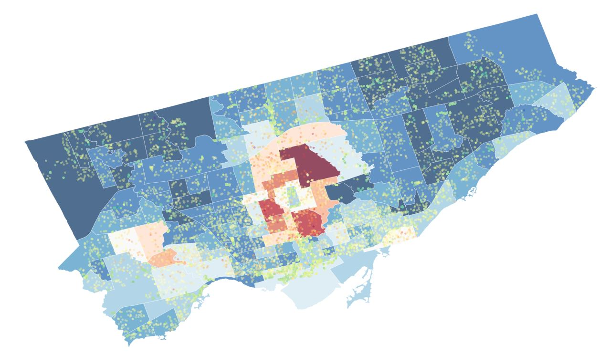

# Toronto Housing Price Prediction # 

The volume of preliminary work this project required amounted to perhaps one of the most challenging yet rewarding experiences I’ve had this summer. Through countless iterations on approach, fetching data, and finalizing model selection to plotting beautiful geomaps, preprocessing, and finally parameters’ tuning, each step produced a POC-like hurdle that took time to overcome but ultimately led to fruitful professional development. Surprisingly, although helpful, a three month data science course I took earlier this year paled in comparison to the growth I experienced spending my Friday nights working on this project in happy solitude.

The deciding factor in terms of subject matter comes from an experience I had last year as a Credit Risk Analyst at a bank. As expected, the role required processing many TFSA, RRSP, investment loan as well as housing applications. It piqued my curiosity into the Ontario housing market, particularly price prediction without manual human involvement. Many questions such as how different areas compare to each other in terms of value, price, demographic distribution, etc, remained unanswered even upon my departure from finance this past year. Since banking institutions have difficulty completely transitioning from their analog/manual past, it ensures working with new, efficient technology an unusual luxury. With my current skillset, I figured I had the tools to attempt a solution.

Special note: The project was based on the real data that came from the bank's database. In order to avoid any confidentiality issues I have decided to recreate the project and use the similar techniques I used there but with the publicly available data. I took advantage of the Canadian government’s enforcement towards real estate companies to disclose their housing sales to the public.

##Related questions:##

- Sources and means to obtain the housing dataset
- Feature engineer new predictors using different sources
- Key insights from current housing market
- ML model selection
- Best approach to hyperparameter optimization

##Project’s key takeaways:##

- Efficient web scraping
- Self built dataset and feature engineering
- Geographical data visualization
- Standardizing and power transforming the data
- Handling missing data
- Creating custom objectives and evaluations for ML model
- Automatic hyperparameter tuning
- Model averaging and Model Stacking

Datasets:

- Handcrafted housing dataset (time horizon - 1 year)
- Geographical data of GTA neighbourhoods
- Neighbourhood profiles (2 – years old)
- Geographical data of Toronto subway lines/stations

Limitation: Although the latest Torontonian income level was unavailable, the relational information from the 2017 dataset sufficed.

**Continue [HERE](https://nbviewer.jupyter.org/github/SlavOK400/Toronto-housing-price-prediction/blob/master/GTA_housing.ipynb)**

 
 
